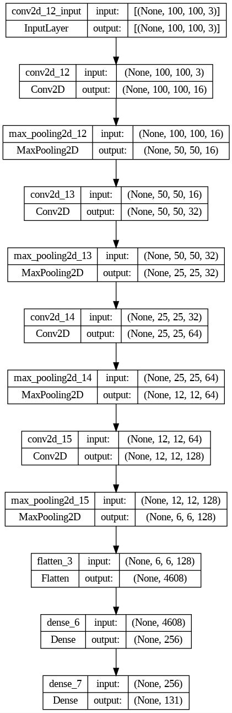

Puedes correr la aplicación con

    streamlit run 'c:/yourpath/frutasClasificacion/pagina.py'

# Clasificación de frutas

En este proyecto, se ha desarrollado un modelo de redes neuronales utilizando capas convolucionales con el objetivo de detectar frutas en imágenes. Para entrenar y evaluar este modelo, se utilizó el popular conjunto de datos ["fruits-360"](https://www.kaggle.com/datasets/moltean/fruits) disponible en Kaggle, que contiene imágenes de diversas frutas en diferentes ángulos sobre fondo blanco.

El uso de redes neuronales convolucionales se ha destacado en el campo de la visión por computadora debido a su capacidad para reconocer patrones y características específicas en imágenes. Estas capas convolucionales son especialmente adecuadas para el procesamiento de imágenes, ya que pueden capturar detalles relevantes a diferentes escalas y aprender representaciones jerárquicas.

El modelo que desarrollamos es el siguiente:

   

Además de desarrollar el modelo de redes neuronales, también se ha creado una aplicación interactiva utilizando Streamlit. Esta aplicación permite observar el funcionamiento del modelo en tiempo real, utilizando la cámara como entrada. 

Nuestros resultados no son los mejores en la aplicación en tiempo real a pesar de haber obtenido mas de 90% de accuracy con las imágenes de test. Esto puede mejorarse por una parte robusteciendo el modelo.

Lo que podemos hacer para mejorar la detección es fusionar algunas de las 131 clases que vienen en el dataset, ya que al ser tantas las variedades de frutas que se pueden predecir, no es suficiente la diferencia en la capa de salida para escojer correctamente la fruta que realmente es.

Además se creó un [video de demostración](https://youtu.be/RPkoHFUd6C4) que muestra en detalle cómo se utiliza la aplicación en tiempo real.
